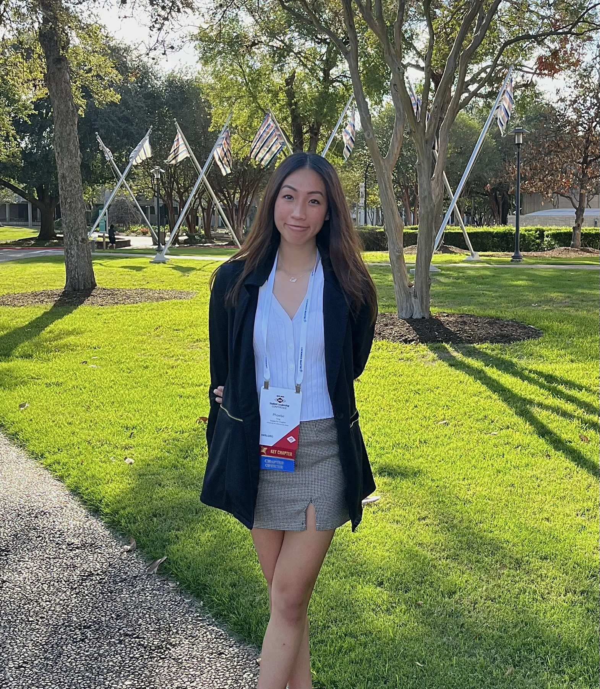
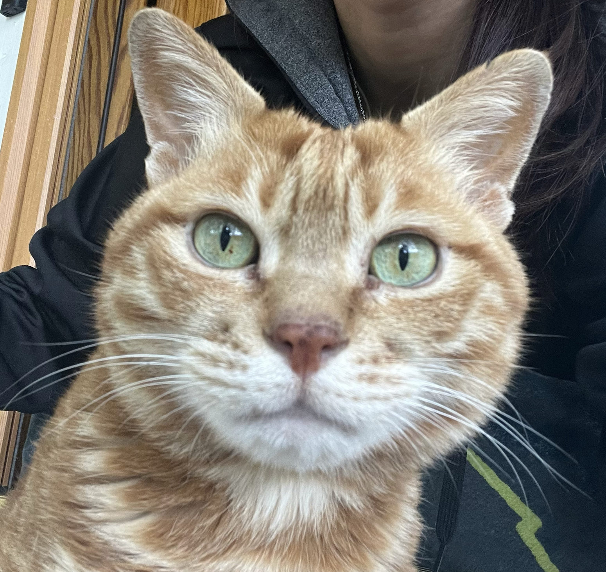
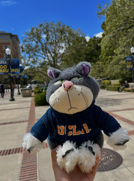
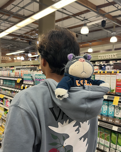
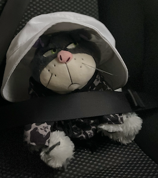
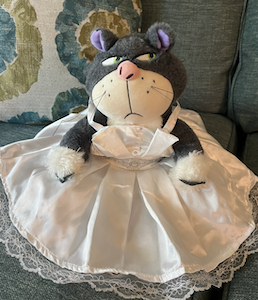

# Phoebe Tang's Page

## Introduction

Hello, I'm Phoebe Tang, a **third-year MATH-CS** Student at UCSD. I am graduating this year and pursuing a master's degree in CS specializing in AI. In my freetime, I like to dance, skate, draw, and game. To find out more about my interests, feel free to skip to the [just for fun section](#just-for-fun). To check out the images used for this page, visit [the img folder](Imgs/).

## Portfolio



### Programming Languages
- **Python**
- **JavaScript**
- **Java**
- **C/C++**
- **HTML/CSS**
- **MATLAB**

### Tools/ Libraries
- *React*
- *Node.js*
- *Git*
- *PostgreSQL*
- *Snowflake*
- *Pandas*
- *OpenCV*
- *OpenGL*

### Projects
- [Pokémon Game](https://github.com/adironene/PokemonGame)
- [Underwater Image Processing algorithm](https://github.com/adironene/underwaterImage)
- [Projects using OpenGL](https://github.com/adironene/MATH-155A-Projects)

### Languages
1. English (native)
2. Chinese (mandarin)(native)
3. French (reading/writing - advanced | speaking/listening - intermediate)


## Just for fun

### Goals before end of 2024

- [x] Commit to a grad school
- [ ] Get my tattoo of my cat
- [ ] Travel to Europe

### Favorite quote

> "All is well"  
> \- Three Idiots

This is my Family's favorite saying. My mom bought me a sign with the quote when I went to college because I was afraid of leaving home and my cat.

### Favorite code to use in the command shell
This command modifies a mp4 file by speeding it up by 4 times, removing sound, and compressing the file. I often use it to reduce my gaming recordings so they erase my mic sounds and speed up the video for the file to be small enough to upload to discord.

```
ffmpeg -i vid.mp4 -filter:v "setpts=PTS/4" -vcodec libx264 -crf 28 -an finished.mp4
```

### My cat

This is Ben, my orange tabby cat. We got him from china so he's actually been in 3 countries and 15 states. He knows how to sit, shake, and dab. If you got to my github profile, you can see that he's in my pfp.

### My child
 

This is my child, Attitude (she goes by Atty). She is half hippo and half tiger. She has been in 2 countries (USA, Costa Rica) and many in counting.

 
